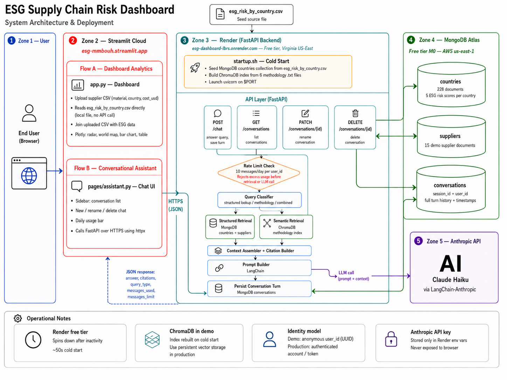

# ESG Supply Chain Risk Dashboard

A Streamlit web application that helps companies understand and visualize Environmental, Social, and Governance (ESG) risks hidden in their supply chains. Includes a conversational RAG assistant that answers questions about supplier risk and ESG methodology.

## What is ESG?

ESG stands for **Environmental, Social, and Governance**. It is a framework used to evaluate how a company impacts the world beyond just profit:

- **Environmental**: How does the company affect the planet? (CO2 emissions, water usage, pollution)
- **Social**: How does the company affect people? (forced labor, child labor, worker safety)
- **Governance**: How is the company managed? (corruption, transparency, ethics)

Companies that ignore ESG risks face real consequences: regulatory penalties, investor backlash, and consumer boycotts. For example, a US apparel company lost over $13 billion in revenue after being exposed for forced labor in its supply chain.

## Features

### Dashboard (app.py)

Users upload a simple CSV with their supply chain cost breakdown (`material, country, cost_usd`) and receive:

- **Radar chart** - overall risk profile across all 5 indicators at a glance
- **Bar chart** - which material drives the most risk for any selected indicator
- **World map** - choropleth showing risk by sourcing country
- **Data table** - full detail, downloadable as CSV

### RAG Assistant (pages/assistant.py)

A conversational assistant that answers natural-language questions about supplier risk and ESG methodology. Example queries:

- "Which of my suppliers have the highest forced-labor risk and why?"
- "What does the CPI score measure?"
- "Compare my Bangladesh vs Vietnam suppliers on water stress."
- "Which material has the highest CO2 risk?"

The assistant retrieves structured country and supplier data from MongoDB, fetches relevant methodology text from a ChromaDB vector index, and generates a cited answer via Claude Haiku.

## How scoring works

Each country is scored on 5 ESG indicators using publicly available data:

| Indicator | What it measures | Source |
|---|---|---|
| CO2 Emissions | Carbon dioxide emissions per person | Our World in Data (Global Carbon Project) |
| Corruption | How corrupt the public sector is | Transparency International CPI 2025 |
| Forced Labor | Prevalence of modern slavery per 1,000 people | Walk Free Global Slavery Index 2023 |
| Water Stress | Ratio of water demand to available supply | WRI Aqueduct 4.0 |
| Child Labor | Percentage of children (5-17) in child labor | UNICEF Jun 2025 |

All indicators are normalized to a **0-10 scale** (0 = lowest risk, 10 = highest) using min-max normalization across 214 countries. Risk scores are **cost-weighted**: suppliers with higher spend contribute proportionally more to the overall risk profile.

## Project structure

```
esg-dashboard/
├── app.py                          # Streamlit dashboard (untouched by assistant work)
├── clean_and_merge.py              # Builds esg_risk_by_country.csv from raw sources
├── esg_risk_by_country.csv         # 214 countries x 5 indicators (normalized 0-10)
├── requirements.txt                # Dashboard dependencies
├── requirements-assistant.txt      # Assistant dependencies
├── docker-compose.yml              # Local MongoDB service
├── .env.example                    # Environment variable template
│
├── pages/
│   └── assistant.py                # Streamlit chat UI (second nav page)
│
└── assistant/
    ├── config.py                   # Settings loaded from .env
    ├── api/
    │   ├── main.py                 # FastAPI app entry point
    │   └── chat.py                 # POST /chat endpoint
    ├── core/
    │   ├── router.py               # Rules-based query classifier
    │   ├── retrieval.py            # MongoDB and ChromaDB retrieval
    │   ├── context.py              # Context assembly and citation extraction
    │   ├── prompt.py               # LangChain prompt templates
    │   └── llm.py                  # Claude Haiku / GPT-4o-mini abstraction
    ├── db/
    │   ├── mongo.py                # PyMongo client and collection accessors
    │   └── chroma.py               # ChromaDB client and e5-small-v2 embeddings
    ├── models/
    │   └── schemas.py              # Pydantic models (ChatRequest, ChatResponse, Citation)
    ├── scripts/
    │   ├── seed_mongo.py           # Loads CSV into MongoDB; generates demo suppliers
    │   └── build_index.py          # Chunks and embeds methodology docs into ChromaDB
    └── data/
        └── methodology/            # Source docs for the knowledge index (6 files)
```

## Architecture



## Tech stack

**Dashboard:** Python, Streamlit, Plotly, Pandas, NumPy

**Assistant:** FastAPI, MongoDB (PyMongo), ChromaDB, LangChain, Anthropic Claude Haiku, `intfloat/e5-small-v2` embeddings (local, via sentence-transformers)

## Running locally

### Dashboard only

```bash
git clone https://github.com/MM-BOUH/esg-dashboard.git
cd esg-dashboard
python3 -m venv venv
source venv/bin/activate
pip install -r requirements.txt
streamlit run app.py
```

### Dashboard + assistant

**1. Install assistant dependencies**
```bash
pip install -r requirements-assistant.txt
```

**2. Start MongoDB**
```bash
docker compose up -d
```

**3. Copy and fill in your environment file**
```bash
cp .env.example .env
# set ANTHROPIC_API_KEY (required)
```

**4. Seed MongoDB**
```bash
python -m assistant.scripts.seed_mongo
```

**5. Build the ChromaDB knowledge index**
```bash
python -m assistant.scripts.build_index
```

**6. Start the FastAPI backend** (keep this running in a separate terminal)
```bash
uvicorn assistant.api.main:app --reload --port 8000
```

**7. Start Streamlit**
```bash
streamlit run app.py
```

Open the app and navigate to the "assistant" page in the Streamlit sidebar.

## Data pipeline

To rebuild `esg_risk_by_country.csv` from raw source data:

1. Place the 5 raw datasets in the project root:
   - `co2.csv` (Our World in Data)
   - `cpi.csv` (Transparency International, converted from xlsx)
   - `slavery.xlsx` (Walk Free)
   - `water.csv` (WRI Aqueduct via World Bank Data360)
   - `child_labor.xlsx` (UNICEF)
2. Run: `python clean_and_merge.py`

## Live demo

[https://esg-mmbouh.streamlit.app](https://esg-mmbouh.streamlit.app/)

## Author

**Mohamed Mehfoud Bouh**
- LinkedIn: [linkedin.com/in/mmbouh](https://linkedin.com/in/mmbouh)
- Google Scholar: [scholar.google.com/citations?user=R5D0BCIAAAAJ](https://scholar.google.com/citations?user=R5D0BCIAAAAJ)

## License

This project is open source. ESG data comes from publicly available sources under their respective licenses (Creative Commons, Open Data).
